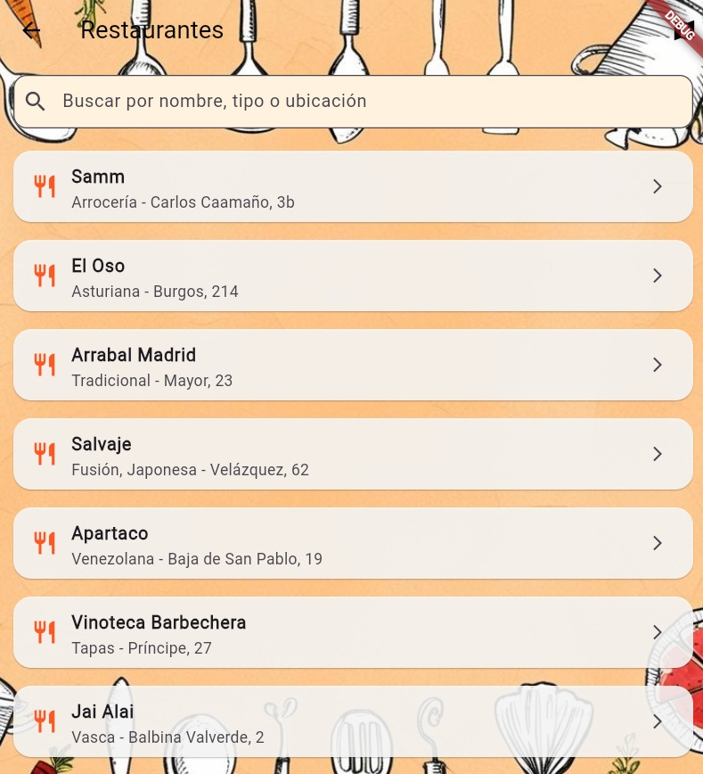
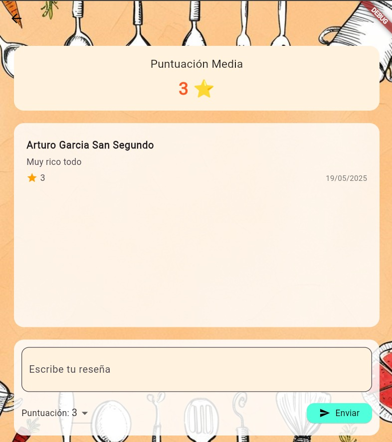
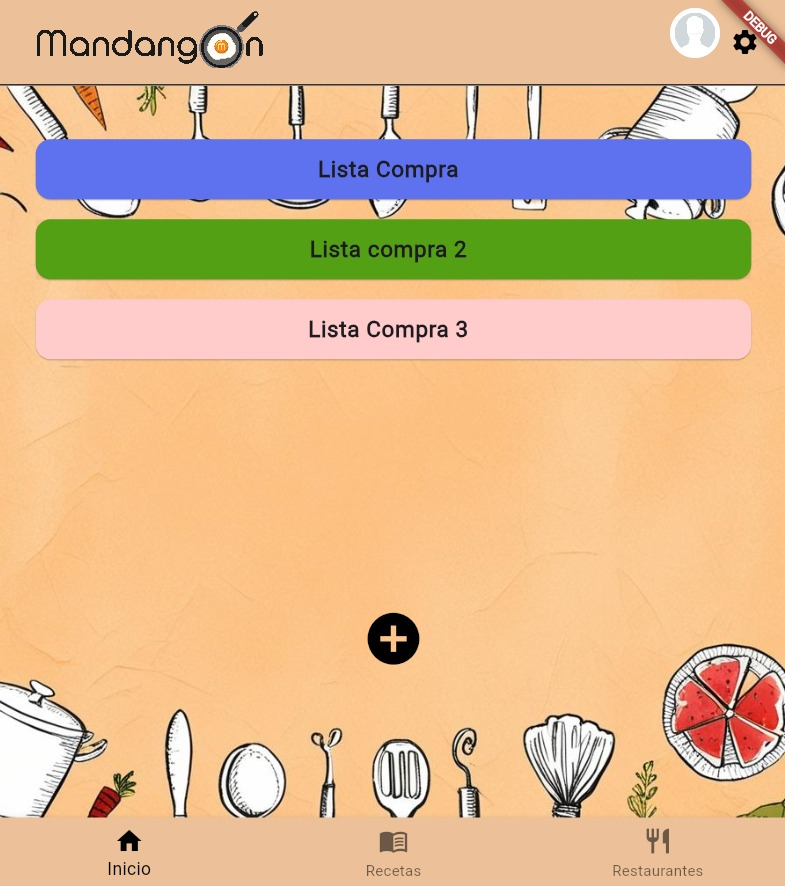
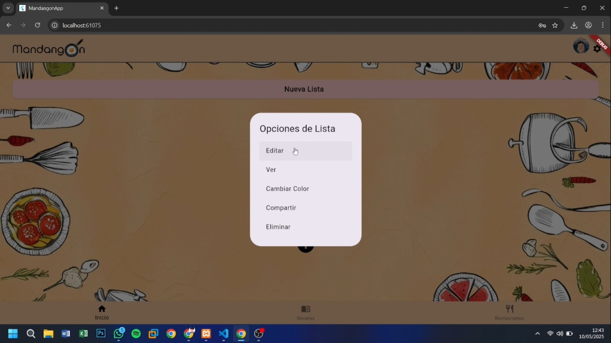
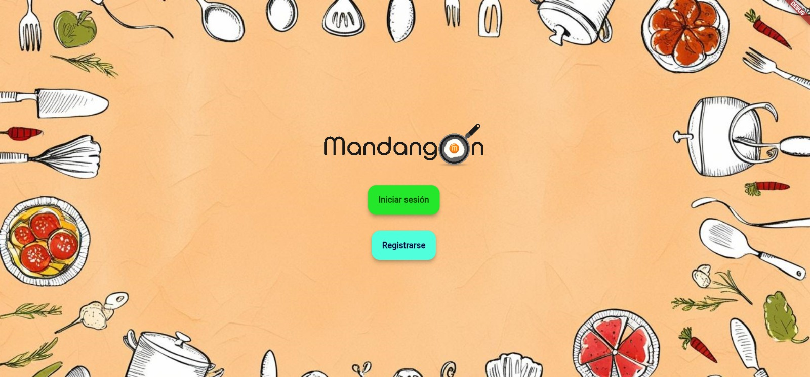
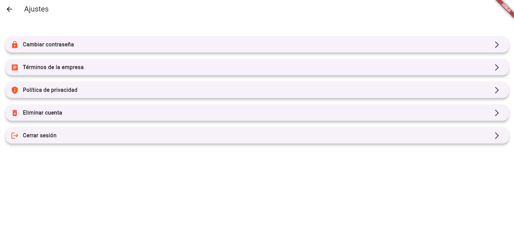

# 🥘 TFG_Mandangon

**Mandangon** es una aplicación de gastronomía desarrollada como Trabajo de Fin de Grado. Su propósito es ofrecer a los usuarios una herramienta intuitiva para crear, consultar y compartir recetas, gestionar listas de la compra, descubrir establecimientos hosteleros y publicar reseñas culinarias.

<p align="left">
  
</p>

---

## 📱 Descripción de la App 📌

Mandangon es una app centrada en la experiencia culinaria del usuario. Desde una interfaz intuitiva y visualmente amigable, permite:

- Crear perfiles mediante autenticación segura.
- Consultar y registrar recetas propias o favoritas.
- Gestionar listas de la compra, clasificadas por ocasión.
- Explorar restaurantes, bares y cafeterías por estilo.
- Publicar y leer reseñas sobre recetas y locales.

## 🧭 Estructura del proyecto

```yaml
lib/
├── pantallas/ # UI principal: login, registro, inicio, etc.
├── funciones/lc/ # Funciones relacionadas con la lista de la compra
├── funciones/usuarios/ # Funciones de autenticación y gestión de usuarios
├── funciones/restaurantes/ # Lógica de exploración y gestión de restaurantes
├── funciones/resenias/ # Módulo de reseñas
├── firebase_options.dart # Configuración de Firebase
```


## 👨‍🍳 Funcionalidades principales

### Recetas
- Visualización de un listado de recetas preexistentes.
- Creación de nuevas recetas con campos como: nombre, ingredientes, instrucciones y tiempos.
- Gestión de listas de recetas favoritas.

<p align="left">
  
</p>

### Hostelería
- Exploración de restaurantes, bares y cafeterías filtrados por estilo.
- Posibilidad de localización y creación de reseñas por parte del usuario.
- Sistema de búsqueda avanzada y favoritos.

<p align="left">
  
</p>

### Reseñas
- Clasificación de establecimientos mediante iconos personalizados.
- Moderación de lenguaje y valoración del 1 al 5.
- Visualización y escritura de comentarios.

<p align="left">
  
</p>

### Lista de la compra
- Creación y almacenamiento de múltiples versiones.
- Organización por eventos como “barbacoa”, “compra mensual”, etc.

<p align="left">
  
</p>

<p align="left">
  
</p>

## 🧩 Dependencias

Asegúrate de tener instaladas las siguientes dependencias en tu `pubspec.yaml`:

```yaml
dependencies:
  flutter:
    sdk: flutter
  firebase_core: ^2.0.0
  cloud_firestore: ^4.0.0
  firebase_auth: ^4.0.0
  provider: ^6.0.0
  shared_preferences: ^2.0.15
  # y otras necesarias para UI, navegación, formularios...
```
---

## 📚 Comentarios al código

### 🔐 Autenticación y gestión de usuarios

- `inicio_sesion.dart`, `registro.dart`, `contrasena.dart`: Manejan la autenticación con Firebase (`FirebaseAuth`), validaciones de formularios, y navegación segura entre pantallas.
- `iniciar_google.dart`: Implementa el inicio de sesión mediante Google Sign-In.
- `validar_usu.dart`: Verifica si un usuario existe en Firestore.
- `aniadir_usu.dart`: Añade nuevos usuarios al sistema una vez registrados.

<p align="left">
  
</p>

### 🛒 Lista de la compra (`lc`)

- `aniadir_lc.dart`, `actualizar_lc.dart`, `eliminar_lc.dart`: CRUD completo para listas de la compra almacenadas en Firestore.
- `agregar_prod.dart`, `eliminar_prod.dart`: Añade o elimina productos dentro de una lista.
- `color_lc.dart`, `ordenar_lc.dart`, `opciones_lc.dart`: Mejoran la UX permitiendo opciones visuales, ordenamiento y accesos rápidos.
- `confirmar_eliminar_lc.dart`, `confirmar_lc.dart`: Cuadros de diálogo que solicitan confirmación antes de acciones críticas.
- `get_lc.dart`: Obtiene todas las listas del usuario autenticado.
- `compartir_lc.dart`: Implementa el mecanismo para compartir listas de la compra entre usuarios registrados.

### 🍽️ Gestión de restaurantes

- `obtener_rest.dart`, `buscar_rest.dart`: Consultan la base de datos de establecimientos. Permiten filtrar por estilo y búsqueda por nombre.
- `aleatorio_rest.dart`: Devuelve un restaurante al azar, ideal para decisiones espontáneas.
- `media_rest.dart`: Calcula la media de valoraciones por establecimiento.
- `direccion_rest.dart`, `web_rest.dart`, `compartir_rest.dart`: Proveen accesos directos a mapas, web oficial y opciones de compartir.
- `restaurantes.dart`, `restaurante_card.dart`: Pantallas e interfaces para mostrar y seleccionar restaurantes.

### ✍️ Módulo de reseñas

- `enviar_rsn.dart`: Permite al usuario añadir una reseña vinculada a un establecimiento.
- `obtener_rsn.dart`: Recupera las reseñas publicadas en Firestore.
- `fecha_rsn.dart`: Genera la marca de tiempo de la reseña para ordenarlas cronológicamente.
- `resenias.dart`: Vista que muestra todas las reseñas, incluyendo comentarios y puntuaciones visuales.

---

<p align="left">
  
</p>

## ✨ Características clave

- 🔐 Autenticación con Firebase y Google.
- 🛒 Listas de la compra inteligentes y compartibles.
- 🍲 Gestión completa de recetas personalizadas.
- 🏪 Exploración de hostelería con filtros dinámicos.
- ⭐ Sistema de reseñas con moderación de contenido.

---

## 📄 Licencia

Este proyecto forma parte del Trabajo de Fin de Grado y su redistribución no está permitida sin autorización expresa del autor.
